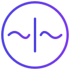
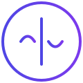

# Om: A Wave-Native Programming Language for Bio-Field Computing


> **Important Notice:** Om Language is currently in the proposal stage. This specification is being shared with the community for feedback and collaboration. We welcome your insights and suggestions to help shape the future of wave-native programming.

## Table of Contents
1. [Introduction](#introduction)
2. [Why Do We Need Om?](#why-do-we-need-om)
3. [Language Design Philosophy](#language-design-philosophy)
4. [Core Features](#core-features)
   - [Wave Streams](#wave-streams-beyond-traditional-data-types)
   - [DNA Processing](#dna-as-a-first-class-citizen)
   - [Vector Operations](#native-vector-operations)
   - [Error Handling](#error-handling-in-nature-inspired-systems)
5. [Implementation Details](#implementation-details)
6. [Developer Ecosystem](#developer-ecosystem)
7. [Real-World Applications](#real-world-applications)
8. [Future Directions](#future-directions)
9. [Community and Contributions](#call-to-action)

## Introduction

In the era of quantum computing and bio-informatics, we face a fundamental challenge: our programming languages still operate on discrete, binary principles while nature computes using waves, fields, and continuous states. Om addresses this gap by being the first programming language designed to speak nature's computational language natively.

### Why "Om"?

The name "Om" carries deep significance:
- **Universal Sound**: Om (ॐ) is considered the primordial sound of the universe, representing the fundamental vibration from which all frequencies emerge
- **Wave Nature**: Like the sound Om itself, our language is built on wave principles
- **Continuous Flow**: The continuous nature of the Om sound mirrors our language's stream-based processing
- **Natural Harmony**: Just as Om represents universal harmony, our language aims to harmonize with nature's computational patterns


### The Om Logo

<div className="flex justify-center items-center gap-8 my-8">
  <div className="text-center">
    
    <p className="text-sm text-neutral-600 dark:text-neutral-400">Primary: Two Waves Design</p>
  </div>
  <div className="text-center">
    
    <p className="text-sm text-neutral-600 dark:text-neutral-400">Alternative: Single Wave Design</p>
  </div>
</div>

**Logo Design Philosophy**

We're leaning towards the two waves design (left) as our primary logo for several reasons:

1. **Visual Balance**: Two waves create perfect symmetry and harmony
2. **Symbolic Meaning**: Represents duality and transformation in nature
3. **Versatility**: Can be expressed elegantly in both graphical and text forms

The text representation maintains this duality while being highly practical:
- Basic form: **~~**
- With transformation: **~|~**
- In expressions: **(~|~)**

This flexibility allows Om to be represented consistently across different contexts:

```om
// In code
leftWave~ | transform | rightWave~

// In documentation
The Om way (~|~) of computing

// In CLI
om-lang (~|~) v0.1.0
```

**Logo Evolution and Decision**

The single wave design (right) emerged from our initial contemplation of duality in nature. We first tried to represent this in text using **(v|^)** to show opposing waves, but ASCII characters limited our ability to express the fluid, continuous nature of Om's transformations.

This led us to explore the two waves design (left), where **(~|~)** naturally emerged as a perfect textual representation. This creates an interesting synergy:
- **Visual Identity**: The single wave logo captures the eternal dance of duality in its purest form
- **Text Expression**: The **(~|~)** provides an elegant way to write and type Om's concepts

This duality between visual and textual representation might be exactly what Om needs:
- Logo: A single wave embodying unity and flow
- Code: Two waves showing transformation and process
- Both: Maintaining Om's philosophical foundation

We'd love to hear your thoughts on this dual approach or if you prefer one design exclusively:

- Join our Discord: [discord.gg/om-lang](https://discord.gg/om-lang)
- GitHub Discussion: [github.com/om-lang/design/discussions/1](https://github.com/univault-org/om-lang/design/discussions/1)

This kind of organic evolution and community discussion is exactly how we envision Om growing - through the harmony of different perspectives coming together to create something greater than the sum of its parts.

### Key Innovations
- Wave-native computation with the **~** operator
- Natural DNA sequence processing
- Bio-field and quantum-like operations
- Parallel processing by default
- Sound-friendly programming paradigm

## Why Do We Need Om?

### Current Limitations

Traditional programming approaches face significant challenges:

```python
# Python: Complex wave processing requires multiple imports
import numpy as np
from scipy import signal
from Bio import Seq

# Separate paradigms for waves and DNA
wave = np.sin(2 * np.pi * 41500 * t)
```

```om
// Om: Natural expression of waves and DNA
const wave~ = oscillate(41.5kHz)
const gene~ = "ATCG" | express | wave(41.5kHz)

// Unified processing
const therapeutic~ = wave~ + gene~
    | harmonize
    | optimize
```

### Sound-Friendly Programming

Om is designed to be the first truly "sound-friendly" programming language, bridging the gap between human speech and code structure. This unique approach makes Om ideal for:

#### Natural Voice Coding
```om
// Om code naturally flows like speech
input~ 
  | filter by frequency
  | transform wave pattern
  | output as sound~
```

When spoken: "Take input wave, filter by frequency, transform wave pattern, output as sound wave"

#### AI Voice Interaction
```om
// AI can naturally verbalize Om code
wave~ | amplify(2x) | modulate~

// Sounds like:
"Take the wave, amplify it twice, then modulate it"
```

#### Sound-Native Features
- **Wave Operators (~)**: Pronounced naturally as "wave"
- **Pipeline (|)**: Spoken as "then" or "into"
- **Transformations**: Use musical and sound terminology
- **Natural Flow**: Code reads like spoken instructions

#### Voice-First Design Principles
1. **Rhythmic Structure**: Code follows natural speech patterns
2. **Sound Semantics**: Operators match acoustic concepts
3. **Flow Patterns**: Matches human thought processes
4. **Verbal Clarity**: Each symbol has a clear verbal equivalent

This sound-friendly approach makes Om uniquely suited for:
- Voice-based programming
- AI code generation from speech
- Code explanation by AI
- Accessible programming for visually impaired developers
- Natural language processing integration

> Om isn't just about writing code - it's about speaking the language of nature and computation in harmony.

## Language Design Philosophy

### Inspired by Nature's Computing

Om's design principles mirror natural processes:

1. **Wave-First**: Everything is a wave
2. **Continuous Flow**: Stream-based processing
3. **Natural Parallelism**: Concurrent by default
4. **Bio-Integration**: DNA and fields as first-class citizens

### Core Symbols

```om
// ~ (Tilde): Wave-nature indicator
const field~ = measure(41.5kHz)

// | (Pipe): Natural transformation flow
const result~ = field~ 
    | normalize 
    | harmonize 
    | apply

// <> (Angle Brackets): Vector operations
const phase = <45°, 90°, 180°>
```

## Core Features

### Wave Streams: Beyond Traditional Data Types

Wave streams (**~**) represent continuous, real-time data flows:

```om
// Traditional: Discrete processing
data.forEach(process)

// Om: Continuous wave processing
signal~
    .frequency(41.5kHz)
    .phase(45°)
    .amplitude(0.8)
    | transform
    | optimize
```

### Type System

Om introduces natural types:

```om
type Wave~ = {
    frequency: Frequency,  // Hz, kHz
    phase: Angle,         // Degrees, radians
    amplitude: Number     // 0.0 to 1.0
}

type DNA = "A" | "T" | "C" | "G"
type DNASequence = DNA[]

type BioField~ = {
    waves: Wave~[],
    patterns: Pattern~[],
    state: QuantumLike~
}
```

### DNA as a First-Class Citizen

Unlike traditional bioinformatics libraries, Om treats DNA natively:

```om
// Traditional languages
const sequence = "ATCG";
protein = translate(transcribe(sequence));

// Om's native DNA processing
const therapeutic~ = "ATCG" 
    | express      // DNA → Protein
    | wave(41.5kHz)// Protein → Wave
    | harmonize    // Optimize wave
```

### Error Handling in Nature-Inspired Systems

Om handles errors naturally, inspired by biological error correction:

```om
try~ {
    const field~ = measure(41.5kHz)
    field~ | express | harmonize
} catch~ (distortion~) {
    field~ | normalize | retry
} finally~ {
    field~ | stabilize
}
```

## Comparison with Existing Languages

### Wave Processing

```python
# Python with NumPy
import numpy as np
from scipy import signal

def process_wave(data):
    fft = np.fft.fft(data)
    filtered = signal.filter(fft)
    return np.fft.ifft(filtered)
```

```om
// Om: Native wave processing
const process = (signal~) => {
    signal~
        | transform
        | filter
        | inverse
}
```

### DNA Processing

```python
# BioPython
from Bio.Seq import Seq
seq = Seq("ATCG")
protein = seq.translate()
```

```om
// Om: Natural DNA operations
const protein~ = "ATCG" | express
```

### Parallel Processing

```javascript
// JavaScript: Manual parallelization
Promise.all([task1, task2, task3])
    .then(process)
```

```om
// Om: Automatic parallel processing
[wave1~, wave2~, wave3~]
    | process  // Naturally parallel
    | combine
```

## Native Vector Operations

One of Om's most powerful features is its native support for vector operations, essential for wave processing, AI integration, and DNA computing.

### Vector Syntax and Wave Integration

Vectors in Om are first-class citizens, seamlessly integrating with wave operations:

```om
// Basic vector operations
const phase = <45°, 90°, 180°>
const amplitude = <0.5, 0.7, 0.9>

// Wave-vector fusion
const wave~ = phase | wave(amplitude)

// Vector arithmetic
const sum = phase + <30°, 45°, 60°>
const scaled = amplitude * 2.0
const dot = phase ⋅ amplitude  // Dot product
```

### Multidimensional Processing

Om supports higher-dimensional structures naturally:

```om
// Matrix definition
const matrix = [
    <1, 2, 3>,
    <4, 5, 6>,
    <7, 8, 9>
]

// Matrix operations
const transformed~ = matrix 
    | wave(41.5kHz)  // Convert to wave matrix
    | harmonize      // Apply to each vector
```

### Bio-Field Vector Applications

Vectors are crucial for bio-field processing:

```om
// Bio-field measurement as vector
const field~ = measure(41.5kHz)
const fieldVector~ = <
    field~.amplitude,
    field~.phase,
    field~.frequency
>

// DNA vector processing
const dnaVector = "ATCG" | encode  // DNA to vector
const protein~ = dnaVector 
    | express 
    | wave(fieldVector~)
```

### AI and Quantum Integration

Om's vector operations naturally support AI and quantum-like computations:

```om
// AI embedding operations
const embedding~ = input~ | model | vectorize
const similarity = embedding~ ⋅ reference~

// Quantum-like state vectors
const state~ = <0.7, 0.7>  // Superposition
const collapsed~ = state~ | measure

// Parallel vector processing
[vector1~, vector2~, vector3~]
    | parallel(normalize)
    | combine
```

### Performance Optimizations

Om automatically optimizes vector operations:

```om
// Hardware-accelerated operations
@optimize("gpu")
const processField = (field~) => {
    const vectors~ = field~
        | splitChannels     // To vector array
        | parallel(fft)     // Parallel FFT
        | combine          // Merge results
    
    return vectors~ | wave(41.5kHz)
}
```

### DNA Processing System

Om treats DNA as a fundamental type with native operations:

```om
// DNA Type System
type Base = "A" | "T" | "C" | "G"
type RNA = "A" | "U" | "C" | "G"
type Codon = [Base, Base, Base]

// DNA Operations
const sequence = "ATCG"
const rna~ = sequence | transcribe  // DNA → RNA
const protein~ = rna~ | translate   // RNA → Protein

// Pattern Matching
match sequence {
    "ATG" => startTranscription(),
    "TAA" | "TAG" | "TGA" => stopTranscription(),
    _ => continue()
}
```

### Vector and Matrix Operations

Native support for multi-dimensional operations:

```om
// Vector Operations
const phase = <45°, 90°, 180°>
const amplitude = <0.5, 0.7, 0.9>

// Matrix Definition
const transform = [
    <1, 0, 0>,
    <0, 1, 0>,
    <0, 0, 1>
]

// Wave-Vector Operations
const field~ = transform * wave~
const interference~ = wave1~ ⋅ wave2~  // Dot product
```

## Implementation Architecture

### Compiler Pipeline

Om's compiler processes code in waves:

```om
// Source Code Wave
source~ 
    | parse           // Syntax analysis
    | analyze         // Semantic analysis
    | optimize        // Wave-specific optimizations
    | generate        // Code generation
    | execute         // Runtime execution

// Example Optimization
@optimize("quantum")
const superpose~ = (wave1~, wave2~) => {
    return wave1~ + wave2~ | normalize
}
```

### Memory Model

Om uses a wave-based memory model:

```om
// Wave Memory Allocation
const buffer~ = allocate(1024, wave)

// Automatic Resource Management
try~ {
    const field~ = measure(41.5kHz)
    field~ | process
} finally~ {
    field~ | release
}

// Memory Patterns
const pattern~ = {
    static: allocateStatic(wave),
    dynamic: allocateDynamic(wave),
    quantum: allocateQuantum(wave)
}
```

### Concurrency Model

Natural parallel processing:

```om
// Parallel Wave Processing
const processes~ = [
    wave1~ | transform,
    wave2~ | normalize,
    wave3~ | harmonize
] | parallel

// Synchronization
const combined~ = processes~
    | synchronize(41.5kHz)
    | combine
```

## Development Tools

### Debug Mode

```om
// Wave Debugging
@debug
const analyze~ = (field~) => {
    debugWave(field~)        // View wave properties
    debugFrequency(41.5kHz)  // Frequency analysis
    debugPhase(45°)          // Phase analysis
}

// DNA Debug Information
@debug
const validateSequence = (dna) => {
    debugSequence(dna)       // Sequence validation
    debugExpression(dna)     // Expression analysis
}
```

## Real-World Applications

### Healthcare and Bio-Field Therapy

```om
const createTherapeutic = (patient~) => {
    // Measure patient's bio-field
    const field~ = measure(patient~)
    
    // Match DNA pattern
    const healing~ = "ATCG" 
        | express 
        | wave(41.5kHz)
        .match(field~)
    
    return healing~
        | optimize
        | apply
}
```

## Developer Ecosystem

### Getting Started with Om

Om provides a modern development environment:

```bash
# Install Om compiler
npm install -g om-lang

# Create new Om project
om init my-biofield-project

# Run Om program
om run therapeutic.om
```

### IDE Support

Om comes with rich IDE integration:
```om
// Intelligent wave completion
const field~ = measure(41.|)  // Suggests kHz frequencies

// DNA sequence validation
const dna = "ATXG"  // Error: Invalid base 'X'

// Wave type checking
const invalid~ = "ATCG" + 41.5kHz  // Error: Cannot add DNA and frequency
```

### Standard Library

Om's standard library includes:

```om
import { wave, dna, vector } from 'om/core'
import { fft, ifft } from 'om/transform'
import { measure, harmonize } from 'om/biofield'

// Wave processing
const process = (signal~) => {
    signal~
        | fft
        | harmonize(41.5kHz)
        | ifft
}

// DNA operations
const analyze = (sequence) => {
    dna.validate(sequence)
    return sequence
        | express
        | wave
}
```

## Implementation Details

### Compiler Architecture

Om uses a multi-stage compilation process:

1. Wave Analysis:
```om
// Source: Continuous wave processing
signal~ | transform

// Compiled: Optimized wave operations
__om_wave_transform(__om_signal, WAVE_OPT)
```

2. DNA Processing:
```om
// Source: DNA operations
"ATCG" | express

// Compiled: Efficient DNA handling
__om_dna_express(__om_sequence_validate("ATCG"))
```

3. Vector Optimization:
```om
// Source: Vector operations
const vec = <1, 2, 3> * 2.0

// Compiled: SIMD instructions
_mm256_mul_ps(__om_vector_load(vec), _mm256_set1_ps(2.0))
```

## Future Directions

### Proposed Features

Om's roadmap includes several exciting possibilities:

1. Quantum Integration:
```om
// Proposed quantum operations
const qubit~ = superpose(|0⟩, |1⟩)
const entangled~ = qubit~ ⊗ reference~
```

2. Advanced DNA Processing:
```om
// Proposed CRISPR-like operations
const genome~ = "ATCG..." | edit {
    target: "GC",
    replace: "TA",
    validate: true
}
```

3. Bio-Field Pattern Recognition:
```om
// Proposed pattern matching
match field~ {
    pattern("healing") => optimize(),
    pattern("stress") => harmonize(),
    _ => stabilize()
}
```

### Community Contributions

We envision Om as a community-driven language. Areas where we seek input:

- Bio-field processing patterns
- DNA computation models
- Wave optimization techniques
- Quantum-like operations
- Hardware acceleration strategies

### Learning from Julia

Om builds upon Julia's successful patterns while adding wave-native capabilities:

#### Multiple Dispatch & Wave Patterns
```om
// Wave-aware multiple dispatch
transform~(dna~)    => // DNA-specific transformation
transform~(quantum~) => // Quantum-specific transformation
transform~(wave~)    => // General wave transformation

// Composable like Julia's functions
compose~ = wave~ 
  | fft 
  | filter 
  | ifft~
```

#### Scientific Computing Heritage
- **Julia's Speed**: Native performance for wave computations
- **LLVM Backend**: Efficient wave-function compilation
- **Type System**: Wave types with quantum characteristics
- **Package Ecosystem**: Bio-field and quantum packages

#### Best Practices Adopted
1. **REPL-First**: Interactive wave manipulation
2. **Notebook Support**: Visual wave analysis
3. **Meta-Programming**: Wave-aware macros
4. **Parallel Computing**: Natural wave parallelization

**Beyond Julia**

Om extends these concepts into wave-native territory:
- Sound-friendly programming
- Natural language integration
- Quantum-classical bridging
- Bio-field computations

> **Om combines Julia's scientific computing power with JavaScript's streaming elegance, creating a new paradigm for natural computation.**

### Join the Development

We're excited to build Om together with the community. Join us in shaping the future of natural computation:

- Discord: [discord.gg/fUPMPT8hVj](https://discord.gg/fUPMPT8hVj)
- GitHub: [github.com/univault-org/om-lang](https://github.com/univault-org/om-lang)
- Discussions: [github.com/univault-org/om-lang/design/discussions](https://github.com/univault-org/om-lang/design/discussions)

> Published: December 27, 2024

### Testing Framework

Om provides wave-aware testing capabilities:

```om
// Wave Test Definition
test~ "Bio-field harmonization" {
    // Setup
    const input~ = generate(41.5kHz)
    
    // Test wave processing
    const result~ = input~ | harmonize
    
    // Wave-aware assertions
    assert~ {
        result~.frequency == 41.5kHz
        result~.phase ≈ 45° tolerance(0.1°)
        result~.amplitude in range(0.8..1.0)
    }
}

// DNA Test Cases
test "DNA sequence validation" {
    const sequence = "ATCG"
    const result~ = sequence | express
    
    assert result~ is valid
    assert result~ contains "ATG"
}
```

## Performance Considerations

### Hardware Acceleration

```om
// GPU Acceleration
@gpu
const processField~ = (field~) => {
    field~
        | parallel(fft)
        | optimize
        | inverse
}

// Quantum Co-processor Support
@quantum
const superpose~ = (states~) => {
    states~
        | entangle
        | process
        | measure
}
```

### Optimization Patterns

```om
// Wave Pattern Optimization
@optimize("wave")
const therapeutic~ = (pattern~) => {
    pattern~
        | cache        // Frequency caching
        | precompute   // Phase calculations
        | streamline   // Pipeline optimization
}

// DNA Pattern Optimization
@optimize("dna")
const sequence~ = "ATCG" | {
    parallel: true,    // Parallel processing
    cache: true,      // Sequence caching
    validate: true    // Real-time validation
}
```

## Best Practices and Guidelines

### Wave Programming Patterns

```om
// Recommended: Wave Composition
const compose~ = (wave1~, wave2~) => {
    wave1~
        | normalize
        | synchronize(wave2~)
        | combine
}

// Avoid: Direct Manipulation
const bad~ = wave~ * 2.0  // Not wave-aware
```

### DNA Processing Patterns

```om
// Recommended: Pattern Matching
match sequence {
    "ATG" => start()
    "TAA" => stop()
    _ => process()
}

// Avoid: String Operations
const bad = sequence.substring(0, 3)  // Treat as string
```

## Integration Examples

### Healthcare Applications

```om
const patientTherapy~ = (patient~) => {
    // Measure bio-field
    const field~ = measure(patient~, 41.5kHz)
    
    // DNA pattern matching
    const pattern~ = patient~.dna | express
    
    // Therapeutic wave generation
    return field~
        | match(pattern~)
        | optimize
        | apply
}
```

### Research Applications

Om provides unique capabilities for quantum biology research, where DNA and quantum effects intersect. Here's how Om can bridge classical DNA processing with quantum computations:

```om
// Example: Quantum-DNA Interface
const quantumDNA~ = (sequence) => {
    // Convert DNA sequence to quantum states
    // Each base pair can be represented as a quantum state
    const state~ = sequence
        | express           // Convert to molecular expression
        | quantize         // Transform to quantum states
    
    // Perform quantum operations
    return state~
        | superpose        // Create superposition of states
        | entangle         // Quantum entanglement
        | measure          // Collapse and measure results
}
```

This enables researchers to:
- Study quantum effects in DNA molecules
- Simulate quantum biological processes
- Investigate quantum coherence in biological systems
- Model quantum-classical transitions in living systems

Real-world applications include:
- DNA mutation analysis
- Protein folding simulations
- Quantum effects in photosynthesis
- Enzyme quantum tunneling studies

## Future Roadmap

1. **Phase 1: Core Implementation**
   - Wave processing engine
   - DNA computation system
   - Basic quantum operations

2. **Phase 2: Ecosystem Development**
   - IDE integration
   - Debug tools
   - Package manager

3. **Phase 3: Advanced Features**
   - Quantum entanglement
   - Advanced DNA editing
   - AI integration

## Community Guidelines

### Contributing

We welcome contributions in the following areas:

### Language Development
- Syntax improvements and refinements
- New operators and expressions
- Pattern matching systems
- Type system enhancements

### Implementation
- Compiler optimizations
- Runtime improvements
- Hardware acceleration strategies
- Memory management techniques

### Applications and Tools
- Healthcare protocols and patterns
- Research tools and frameworks
- Educational resources
- Development tools

### Documentation
- Language specification
- Tutorial materials
- Best practices guides
- Use case studies

### Community
- Code reviews
- Testing and feedback
- Mentoring new contributors
- Community events

To get started:
1. Read our contribution guidelines
2. Join our Discord community
3. Check open issues on GitHub
4. Share your use cases and ideas


Discord: [Join Om Lang Community](https://discord.gg/fUPMPT8hVj)

> **Note:** As Om is in the proposal stage, we especially welcome feedback on the core language design and implementation strategies.
